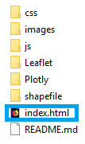
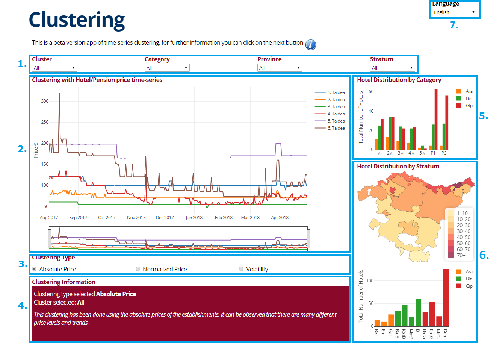
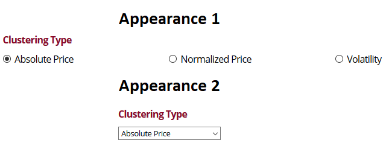
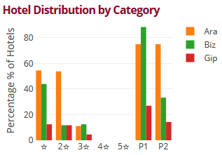
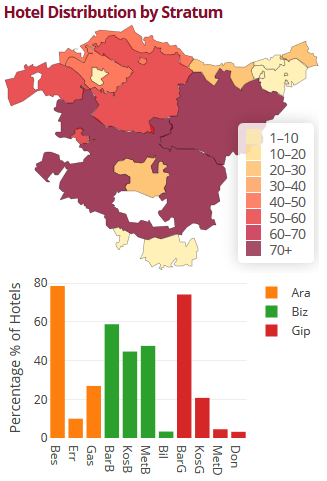
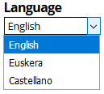

# Hotel - Clustering v2

This is a project of <a href="http://en.eustat.eus/indice.html">Eustat</a> with the objective of making different clusterings with the price of the hotels and pensions of the Basque Country. The prices of the establishments have been taken from <a href="https://www.booking.com">Booking</a> using different web-scraping methods.

120 requests have been done per each day and each hotel/pension. In other words, the price of the next 120 days has been collected daily and the unit of analysis has been the standard double room with bathroom, without breakfast and without VAT. Once the 120 requests were done, we took the median of those prices for the posterior analysis.

These README.md is divided in few sections:
 - [How to use](#how-to-use)
 - [App description](#app-description)
 - [Clustering methodology](#clustering-methodology)
 - [Libraries](#libraries)
 
## How to use

This app can be used cloning this repository using `git` command:

```
$ git clone https://github.com/AsBaZa/Hotel-Clustering-v2
```

or downloading directly from `https://github.com/AsBaZa/Hotel-Clustering-v2`, clicking on the button:

<p align="center">
 
</p>

Once the repository is downloaded, it can be opened clicking on the `index.html` file:

<p align="center">
 
</p>

The file can be opened with the newest versions of web browsers such as [Firefox](https://www.mozilla.org/), [Google Chrome](https://www.google.com/chrome/), [Opera](https://www.opera.com/), [Safari](https://www.apple.com/safari/) or [Microsoft Edge](https://www.microsoft.com/windows/microsoft-edge). However, the app is not compatible with older web browsers such as [Internet Explorer](https://www.microsoft.com/download/internet-explorer.aspx).

In the next section ([App description](#app-description)), the user can find more information about the app.

**Note:** No internet connection is required to use it.

## App description

The app is divided in 7 main areas:
 1. [Navigation bar](#1-navigation-bar)
 1. [Clustering plot](#2-clustering-plot)
 1. [Clustering buttons](#3-clustering-buttons)
 1. [Clustering information box](#4-clustering-information-box)
 1. [Hotel distribution by category](#5-hotel-distribution-by-category)
 1. [Hotel distribution by stratum](#6-hotel-distribution-by-stratum)
 1. [Language](#7-language)

<p align="center">
 
 <figcaption>The distribution and the appearance of the image above may change a little bit depending on the screen size phone, tablet or computer.</figcaption>
</p>


### 1. Navigation bar

The navigation bar is divided in 4 parts and each of them is a selector that interacts with the charts. 
 - **Cluster**: we can show all the groups (medoids of the clusters) or focus only on a specific one. If *'All'* option is selected, **TOTAL** statistics will be shown on the [Hotel distribution by category](#5-hotel-distribution-by-stratum) and [Hotel distribution by stratum](#6-hotel-distribution-by-stratum), such as how many hotel/pensions are per each category and province. Otherwise, if a specific cluster is selected, the medoid of that cluster will be shown in the [Clustering plot](#2-clustering-plot) and the other 3 charts will show the **PERCENTAGE** of the establishments (broken down into categories and stratums) belonging to that cluster.
 - **Category, Province, Stratum**: these selectors are simply some filters that can be used to take more specific information.

### 2. Clustering plot

In this chart, the medoids (the representative element of the group) of the clustering are plotted. The elements of the project have been the price time-series of hotels, that is why the medoids are also time-series. In the initial screen, 6 time-series are shown but if we change the value of the **Cluster** selector of the [Navigation bar](#1-navigation-bar), a specific price time-series will be printed.

For this project, 3 different clusterings have been done or in other words, there have been 3 different criterias to group the establishments using their prices:

- **Using their absolute price**: the main goal was to classify hotels and apartments by its prices.
- **Using their normalized price**: the idea of normalizing the prices was to compare the elements by its trend. In that way, we can classify the hotels with bigger changes in the price during the year and the others with fewer changes.
- **Focusing on the volatility**: in this case, the classification has been done according to the volatility of the prices. For that purpose *close-to-close volatility estimator* has been used.

Further information about clustering methods used in this project can be found in section [Clustering methodology](#clustering-methodology).

### 3. Clustering buttons

These buttons change the clustering method used in this study and consequently, the medoids (the representative elements of the group) of the [Clustering plot](#clustering-plot) change when the user interacts with these buttons. (More information about clustering methods can be found in [Clustering methodology](#clustering-methodology)). 

Depending on the size of the screen, the appearence may change.

<p align="center">
 
</p>

### 4. Clustering information box

Here, the app shows information about the clusters.

### 5. Hotel distribution by category

This is a bar chart that shows the distribution of the hotels by its category. If *'All'* is selected in the **Cluster** element of the [Navigation bar](#1-navigation-bar), the chart shows all the hotels and pensions (applying the filters of the [Navigation bar](#1-navigation-bar)). Otherwise, the app plots the percentage of the establishments that belongs to the selected cluster.

In the next example, it can be observed that more than the 40% of 1-star hotels of Araba (Ara) and Bizkaia (Biz) belong to the cluster that has been selected. In the same way, it can be observed that there is not any 5-star hotel belonging to the selected cluster.

<p align="center">
 
</p>

### 6. Hotel distribution by stratum

These 2 plots show the Basque Autonomous Community, divided in 11 different stratums:

 - Rest of Araba
 - Rioja Alavesa
 - Vitoria-Gasteiz
 - Inland Bizkaia
 - Coast of Bizkaia
 - Metropolitan Area of Bilbao
 - Bilbao
 - Inland Gipuzkoa
 - Coast of Gipuzkoa
 - Metropolitan Area of Donostia-San Sebastián
 - Donostia-San Sebastián
 
Those 2 plots show the distribution of the hotels by the stratum they belong to. If *'All'* is selected in the **Cluster** element of the [Navigation bar](#1-navigation-bar), the charts show all the hotels and pensions (applying the filters of the [Navigation bar](#1-navigation-bar)). Otherwise, the app plots the percentage of the establishments that belongs to the selected cluster.

In the next example, it can be observed that more than the 60% of the establishments belonging to Rest of Alava (Bes) are in the selected cluster (also more than the 60% of the establishments belonging to Inlan of Gipuzkoa (BarG) are in the selected cluster).

<p align="center">
 
</p>

### 7. Language

This bar changes the language of the app. The 3 available options are:

 - English
 - Euskera
 - Castellano
 
<p align="center">
 
</p>

## Clustering methodology

In this app 3 different methods have been used in order to group hotels and make clusters using distincts criterias. The software used for that purpose is [R](https://www.r-project.org/) and the main libraries:
 - [TSdist](https://CRAN.R-project.org/package=TSdist)
 - [TSclust](https://CRAN.R-project.org/package=TSclust)
 - [dtw](https://CRAN.R-project.org/package=dtw)
 
Keep in mind that the elements that are grouped into clusters in this app are price time-series.

### Clustering with Absolute Prices

This clustering has been done with the absolute prices that were obtained web-scraping [Booking](https://www.booking.com/). After many distances between time-series were tested to do the clustering, the Euclidean distance was taken. Very satisfactory results were obtained using that distance and it is one of the easiest to learn and explain. The number of clusters was decided using the silhouette method or criteria.

The main goal of this clustering is to show different price rates of the establishments and to observe if the prices are changing or not during the year.

### Clustering with Normalized Prices

The method used in this clustering is the same as seen above in [Clustering with Absolute Prices](#clustering-with-absolute-prices). The difference is that instead of using absolute price time-series, those time-series have been normalized between 0 and 100 using the next *Min-Max* formula:

<p align="center">
 
</p>

where
 -  : original price time-series.
 -  : price of a specific day.
 -  : normalized price of a specific day.

If we focus on the formula above, there is a problem for the hotels or pensions with constant price, since we get an indetermination. For those establishments, many different constant prices have been tested: 0, 50, 100... and the best results were obtained giving the constant value 100 to those establishments.

The main goal of this clustering is to classify hotels and pensions depending on the change or variation they suffer in their price during different seasons of the year.

### Clustering Using the Price Volatility

The volatility measure has been done using the next formula:

<p align="center">
 
</p>

That formula is based in *close-to-close volatility estimator*, but instead of calculating the standard deviation, the mean is taken (Further information about different volatility measures can be found on the reference manual of [TTR](https://CRAN.R-project.org/package=TTR) library, volatility section).

The main goal of this clustering is to classify hotels and pensions depending on the daily volatility of their prices.

## Libraries

The libraries used in this app are mainly [Plotly](https://plot.ly/javascript/) (for the charts) and [Leaflet](https://leafletjs.com/) (for the map).

<p align="center">
 
</p>
